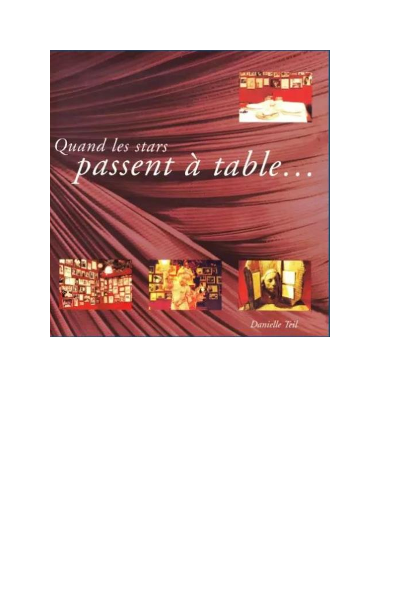
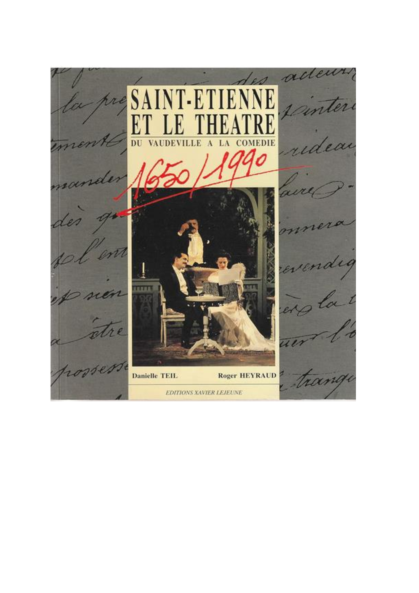

<!doctype html>
<!--
  index.html
  Page statique bilingue FR / EN prête à être déposée à la racine du dépôt GitHub

  Instructions :
  1) Remplace l'ancien fichier par celui-ci et nomme-le exactement `index.html` à la racine du repo.
  2) Dépose les images `Stars.png` et `ST-etienne-theatre.png` à la racine (même dossier que index.html).
  3) Active GitHub Pages (branche main, dossier: / root) si ce n'est pas déjà fait.
  4) Teste l'URL : https://danielleteil.github.io/danielle-teil-auteure/  (les boutons FR / EN basculent le texte)

  Remarque SEO : ce fichier utilise JSON-LD et meta tags. Pour une vraie stratégie SEO, créez aussi une page /en/index.html (optionnel) et soumettez l'URL à Google Search Console.
-->
<html lang="fr">
<head>
  <meta charset="utf-8">
  <meta name="viewport" content="width=device-width,initial-scale=1">
  <title>Teil Danielle — Écrivaine — "Quand les stars passent à table" • "Saint-Étienne et le théâtre"</title>
  <meta name="description" content="Page officielle de Teil Danielle — auteure, résumés et couvertures de ses ouvrages. Contact : dteil1243@gmail.com" />
  <meta name="keywords" content="Teil Danielle, écrivaine, auteur, théâtre, Saint-Étienne, biographie" />
  <meta property="og:title" content="Teil Danielle — Écrivaine" />
  <meta property="og:description" content="Auteure de 'Quand les stars passent à table' et 'Saint-Étienne et le théâtre'." />
  <meta property="og:type" content="profile" />
  <meta property="og:locale" content="fr_FR" />
  <link rel="alternate" hreflang="fr" href="/" />
  <link rel="alternate" hreflang="en" href="/?lang=en" />
  
</head>
<body>
  

    <header>
      

        
Teil Danielle

        
Écrivaine — Author

      

      

        

          <button class="lang" id="btn-fr" aria-pressed="true" aria-controls="content">FR</button>
          <button class="lang" id="btn-en" aria-pressed="false" aria-controls="content">EN</button>
        

      

    </header>

    <section class="cards" aria-label="Ouvrages" id="content">
      <article class="card" id="book1">
        

        <h3 class="title-book" id="title1">Quand les stars passent à table</h3>
        
Septembre 1999 — Indépendant

        
Biographie d'un célèbre restaurateur, Marco Cruciani, qui recevait à sa table les stars du spectacle. Chacune d'entre elles lui laissaient une signature sur son livre d'or, qui comporte aujourd'hui plus de 3000 signatures. De Petrucciani à Jean-Jacques Goldman, de Jane Birkin à Pierre Bachelet, ils sont nombreux à s'être confiés à Marco.

      </article>

      <article class="card" id="book2">
        

        <h3 class="title-book" id="title2">Saint-Étienne et le théâtre</h3>
        
Octobre 1990 — Éditions Xavier Lejeune

        
Du vaudeville à la comédie : 1650 - 1990. Trois siècles de vie locale, mais aussi une histoire qui dépasse largement les horizons de la ville et intègre l'histoire du théâtre en France. Saint-Étienne, le berceau de la décentralisation théâtrale, n'a sans doute jamais mieux mérité ce qualificatif avec l'histoire européenne qu'elle a amorcée. De grands hommes, comme Dasté, ont fait son histoire et aujourd'hui la Comédie de Saint-Étienne est un des plus grands centres dramatiques nationaux.

      </article>
    </section>

    <footer>
      
Contact : <a href="mailto:dteil1243@gmail.com">dteil1243@gmail.com</a>

      
    </footer>
  

  
</body>
</html>
